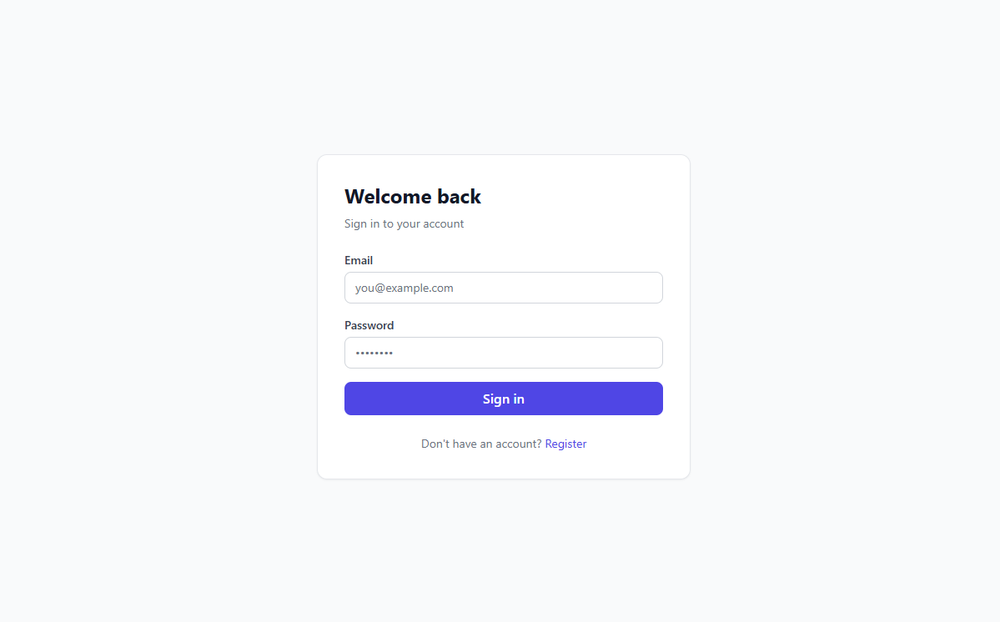
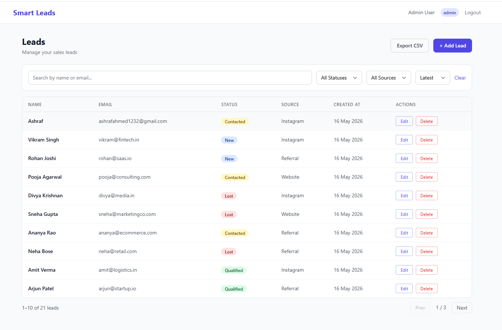
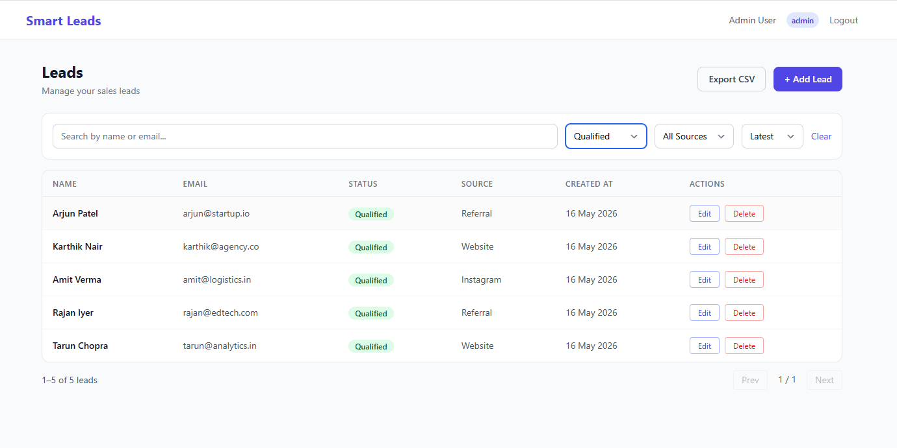

# Smart Leads Dashboard

A full-stack Lead Management Dashboard built with the MERN stack and TypeScript.

**Live Demo:** https://smart-leads-dashboard-jqiqrlnpn-ashraf-s-projects2.vercel.app

**Backend API:** https://smart-leads-server-izyb.onrender.com

## Screenshots





## Features

- JWT-based authentication (register / login / protected routes)
- Role-Based Access Control — Admin and Sales roles
- Full Lead CRUD — create, view, update, delete
- Advanced filtering by status, source, and free-text search
- Debounced search (400ms) to minimize API calls
- Backend pagination — 10 records per page with metadata
- CSV export with active filters applied (admin only)
- Loading skeletons, empty states, error states
- Confirmation modal for destructive actions
- Responsive UI built with TailwindCSS
- Docker + docker-compose setup
- Seed script with 2 users and 20 realistic leads

## Tech Stack

| Layer | Tech |
|-------|------|
| Frontend | React 18, TypeScript, Vite, TailwindCSS |
| State | TanStack Query (server), Context API (auth) |
| Forms | React Hook Form + Zod |
| Backend | Node.js, Express, TypeScript |
| Database | MongoDB + Mongoose |
| Auth | JWT + bcrypt |
| Validation | Zod (frontend + backend) |
| Infra | Docker, docker-compose, MongoDB Atlas |

## Role-Based Access Control

| Action | Admin | Sales |
|--------|-------|-------|
| View leads | ✅ | ✅ |
| Create lead | ✅ | ✅ |
| Update lead | ✅ | ✅ |
| Delete lead | ✅ | ❌ |
| Export CSV | ✅ | ❌ |

> Admin self-registration is intentionally disabled. Admins are seeded directly into the database to prevent privilege escalation.

## Local Setup

**Prerequisites:** Node.js 18+, MongoDB Atlas account (free tier)

### 1. Clone the repository

```bash
git clone https://github.com/AshrafAhmed9/smart-leads-dashboard.git
cd smart-leads-dashboard
```

### 2. Backend

```bash
cd server
npm install
cp .env.example .env
npm run dev
```

### 3. Seed the database

```bash
npm run seed
```

Creates:
- `admin@example.com` / `Admin1234!`
- `sales@example.com` / `Sales1234!`
- 20 realistic leads

### 4. Frontend

```bash
cd ../client
npm install
cp .env.example .env
npm run dev
```

Open `http://localhost:5173`

## Docker

```bash
docker-compose build
docker-compose up
```

## Environment Variables

### `server/.env`

```
PORT=5000
MONGODB_URI=your_mongodb_atlas_connection_string
JWT_SECRET=your_secret_key
CLIENT_URL=http://localhost:5173
```

### `client/.env`

```
VITE_API_URL=http://localhost:5000/api
```

## Project Structure

```
smart-leads-dashboard/
├── server/
│   └── src/
│       ├── config/        # Database connection
│       ├── controllers/   # Route handlers
│       ├── middleware/    # Auth, role, error middleware
│       ├── models/        # Mongoose models
│       ├── routes/        # Express routers
│       ├── validations/   # Zod schemas
│       └── utils/         # Response helpers
├── client/
│   └── src/
│       ├── api/           # Axios + API functions
│       ├── components/    # Reusable UI + lead components
│       ├── context/       # Auth context
│       ├── hooks/         # useLeads, useDebounce
│       ├── pages/         # Login, Register, Leads
│       └── types/         # TypeScript interfaces
└── docker-compose.yml
```

## API Reference

| Method | Endpoint | Auth | Role | Description |
|--------|----------|------|------|-------------|
| POST | /api/auth/register | No | — | Register new user (always sales role) |
| POST | /api/auth/login | No | — | Login and receive JWT |
| GET | /api/auth/me | Yes | Any | Get current user |
| GET | /api/leads | Yes | Any | List leads with filters and pagination |
| POST | /api/leads | Yes | Any | Create a new lead |
| PATCH | /api/leads/:id | Yes | Any | Update a lead |
| DELETE | /api/leads/:id | Yes | Admin | Delete a lead |
| GET | /api/leads/export/csv | Yes | Admin | Export filtered leads as CSV |

### Query Parameters for `GET /api/leads`

| Param | Type | Description |
|-------|------|-------------|
| page | number | Page number (default: 1) |
| limit | number | Records per page (default: 10) |
| status | string | New, Contacted, Qualified, Lost |
| source | string | Website, Instagram, Referral |
| search | string | Search by name or email |
| sort | string | latest or oldest |
